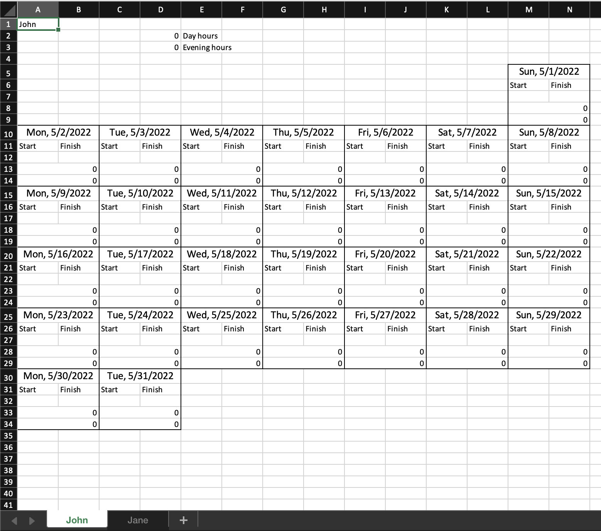
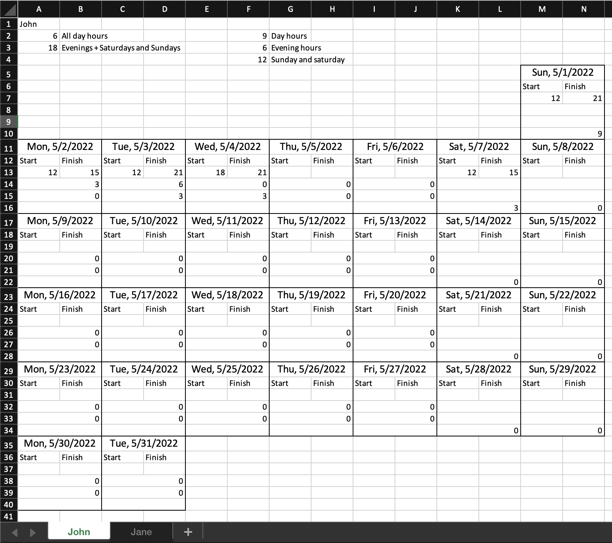

# Excel-based work-hours logging
Generate excel workbooks for logging monthly work-hours. For personal use or to share in e.g. Google Sheets among employees.

</img>

## Usage
1. Start the application server `npm start`
2. Send request for creating a workbook
`POST localhost:8080/` with request body
```
{
    "month": 4,
    "names": ["John","Jane"]
}
```
- Months range from 0-11, where 0 = January.
- A sheet is created for each name. Names can be e.g. employee names,
if employer wants to create a sheet for each employee. Names could also be project names, if a freelancer wants to log hours separately
for different projects.

## Example use-case
A company wants to provide their employees John and Jane automatized way of calculating their monthly work-hours. The company pays different hourly rates for their employees on the following conditions:
- X/hour before 18:00 during weekdays Mon-Fri
- Y/hour after 18:00 during weekdays Mon-Fri
- Y/hour on Saturdays and Sundays

The user also wants to summarize the hours that will be paid by the same rates (X and Y) together.

The following configuration would output a suitable sheet for the company:
```
{
    "month": 4,
    "names": ["John","Jane"],
    "config": {
        "formulas": [
            {
                "type": "DAY",
                "name": "Day hours",
                "disabledForCols": ["K", "M"]
            },
            {
                "type": "EVENING",
                "name": "Evening hours",
                "disabledForCols": ["K", "M"]
            },
            {
                "type": "ALL",
                "name": "Sunday and saturday",
                "disabledForCols": ["A", "C", "E", "G", "I"]
            }
        ],
        "summary": {
        "aggregators": [
            {
                "functionIndexes": [1],
                "header": "All day hours"
            },
            {
                "functionIndexes": [1,2],
                "header": "Evenings + Saturdays and Sundays"
            }
        ]
    }
    }
}
```


Read more about different configuration options in "Configurations" section.

## Configurations
User can configure the workbook in several different ways:

### Weekdays included in the sheet
User can exclude weekdays from the sheet if e.g. employees are not working on Sundays.
```
{
    "month": 4,
    "names": ["John","Jane"],
    "days": 6
}
```
This configuration would exclude Sundays from the sheet.

### Language
User can define the locale used with the weekday formatting. Other values like the formula names and the summary headers are not affected by the locale but can be customized.
```
{
    "month": 4,
    "names": ["John","Jane"]
    "config": {
        "locale": "fi-FI
    }
}
```

### Formulas that calculate daily hours
```
{
    "month": 4,
    "names": ["John","Jane"]
    "config": {
        "formulas": [
            {
                "type": "DAY",
                "name": "Before 18",
            },
            {
                "type": "EVENING",
                "name": "After 18",
            },
            {
                "type": "ALL",
                "name": "All together",
            }
        ],
    }
}
```

Formula includes a type and a name. Currently there is three different types:
1. 'DAY': hours before 18:00
2. 'EVENING': hours after 18:00
3. 'ALL': all hours

Name can be any string, which will appear with the total sum of the given formula on top of the sheet.

The default configuration includes 'DAY' and 'EVENING' formulas.

### Exclude some formulas on selected columns (weekdays)
```
{
    "month": 4,
    "names": ["John", "Jane"],
    "config": {
        "formulas": [
            {
                "type": "DAY",
                "name": "Päivätunnit",
                "disabledForCols": ["M"]
            },
            {
                "type": "EVENING",
                "name": "Iltatunnit",
                "disabledForCols": ["M"]
            },
            {
                "type": "ALL",
                "name": "Sunnuntai",
                "disabledForCols": ["A", "C", "E", "G", "I", "K"]
            }
        ]
    }
}
``` 
This example represents a use-case where user wants to only calculate all hours together on Sundays, but separately calculate day and evening hours on other days. User can disable specific formulas for specific columns (A-K <-> Mon-Sun)

### Summarize the results of the formulas
If user wants a customized summary about the results of the defined formulas, it's possible to define 'aggregators':
```
{
    "month": 4,
    "names": ["John","Jane"],
    "config": {
        "formulas": [
            {
                "type": "DAY",
                "name": "Day hours",
                "disabledForCols": ["K", "M"]
            },
            {
                "type": "EVENING",
                "name": "Evening hours",
                "disabledForCols": ["K", "M"]
            },
            {
                "type": "ALL",
                "name": "Sunday and saturday",
                "disabledForCols": ["A", "C", "E", "G", "I"]
            }
        ],
        "summary": {
          "aggregators": [
              {
                  "functionIndexes": [1],
                  "header": "All day hours"
              },
              {
                  "functionIndexes": [1,2],
                  "header": "Evenings +   Saturdays and Sundays"
              }
          ]
      }
    }
}
```
Aggregator describes which functions are summed up together in the summary, and a custom header that will be displayed on the sheet with the result. E.g. "functionIndexes": [1,2] will output the results of the second and the third formula defined in "formulas" array (indexes start from 0).